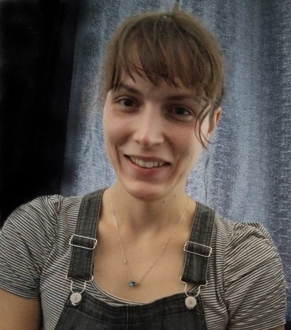

## Home
{: width="200px" style="float:left; padding-right:10px" }
My name is Aurora Vogel and I am an Applied Maths M.S. Student as SDSU. I am a member of the [Luque Lab](https://www.luquelab.com/) which conducts research centered around the structural and ecological properties of viruses. My research interests include the mathematical underpinnings of capsid structures. My current goals include expanding the mathematical foundations of elongated and conical capsid structures of viruses alongside creating 3D models of said structures. Currently, I am in the process of formally writing out the maths behind the icosahedral, elongated, and conical structures.

## [Heilmeier Catechism](https://www.darpa.mil/work-with-us/heilmeier-catechism/)
**What are you trying to do?**

My primary objective is to adapt the theory of capsid geometries to conical capsids. On the way, I will be building upon the current theory of elongated capsid geometries to include the recently discovered icosahedral lattices (Luque and Reguera, 2010; Twarock and Luque, 2019).

**How is it done today?**

Currently the theory of elongated capsids only includes hexagonal lattices, while there is no solid theory for generating conical structures. Previous attempts involved using the CK framework and have failed to capture known examples.

**What is new in your approach?**

A theory of conical capsids, separate from CK, has not been attempted. My approach will involve assigning _T_-numbers, $$T_{small}$$ and $$T_{large}$$, for each cap of the capsid, where our working hypothesis is that the $$T_{small}$$ and $$T_{large}$$ belong to the same _P_-class. The mathematical theory behind elongated viral structures assumes a hexagonal lattice. Exchanging the hexagonal lattice for one of the additional Archimedean lattices. 

In both cases, new structure will arise which will be explored and characterized. This will include deriving the radius of each cap, length, positions of proteins, protein stoichiometry rules, icosahedral class P, _T_-numbers, and the icosahedral lattice.

**Who cares?**

Our lab, structural biologists, biotechnologists, applied geometers, biomedical scientists and engineers 

**What difference will it make?**

The extended elongated capsid theory will serve as a quantitative means for studying viral evolution, allow targeted antiviral strategies to be developed that work generically, and offer finer control in capsid engineering. A conical capsid theory, which includes well known examples, would be a first of its kind and would be testable against molecular models such as those of HIV obtained from cryo-EM reconstructions (Zhao et al, 2013). An accurate structural model for HIV would, for example, allow for novel antiviral strategies against HIV.

**What are the risks and payoffs?**

The main risk is that the extending of the theory for the elongated and conical structures is not feasible in the given time frame. For the elongated structures, this is highly unlikely, since the extension of the theory will involve a straightforward replacement of the lattice, which will result in adjusted lattice vectors ($$C_Q$$,$$C_T^{120}$$). The corresponding changes in the mathematical structure need to be merely catalogued. 

For the conical structures, a construction involving $$T_{small}$$ and $$T_{large}$$ and a shared _P_-class has already been done for a handful examples successfully. The challenge is in generalizing the construction, which involves some uncertainty. 

The main payoffs are mentioned in (5). An additional payoff is that a set of previously unclassified or misclassified viruses is now classifiable. This will enhance our understanding of such viruses as it is our hypothesis that the structural classifications are tied to viral replication strategies and types of capsid protein folds.

**How much will it cost?**

Yearly Salary: $20,000
 
Computer Needs: $171.00 (Mathematica, student license)
 
Publication Fees: $5,560 (>=1 Open access paper)
 
Conferences: $2,000
	
**How long will it take?**

Including the additional lattices in the theory for elongated capsids and the implementation of the elongated structures in ChimeraX will be finished by August 2022. The mathematics of the conical structures will be done by December 2022.

**What are the midterm and final check points for success?**

1. The first checkpoint is to successfully adapt the theory of elongated capsids to include the additional icosahedral lattices.
2. A second checkpoint is to implement this adaptation by coding the elongated capsid models in Chimera. This will be done no later than August 2022.
3. The third and final checkpoint is to establish the mathematical foundations for conical structures using a two _T_-number model. This will involve deriving all of the expressions described above (3).
4. If this is all achieved, ChimeraX models will be coded for the conical structures.

